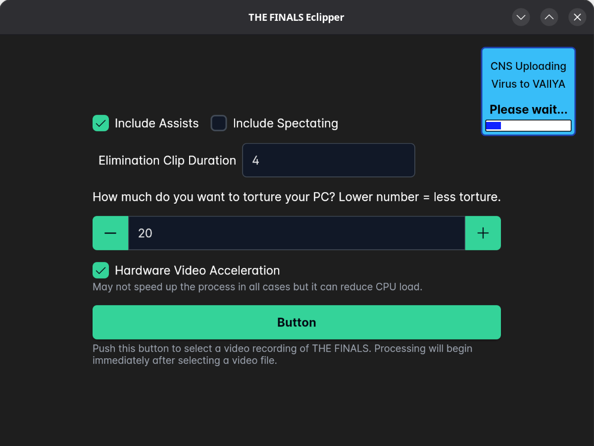
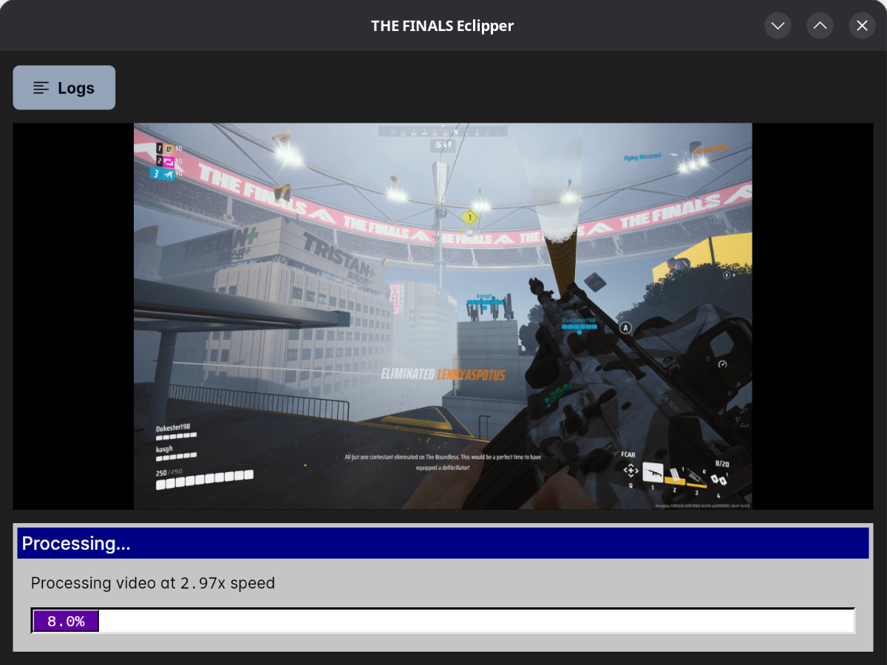
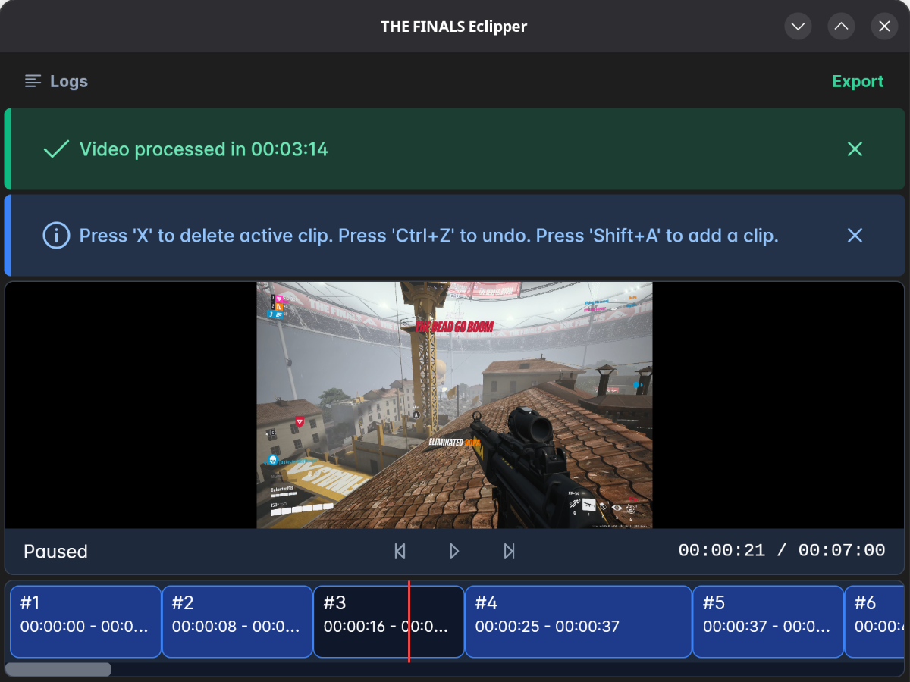

# THE FINALS Eclipper

A tool to create a montage of highlights from a recording of THE FINALS.

## Features
### Lossless Cutting
Exporting is lossless, processing may be slow, but once you export the video, it should be fast without any loss in quality from the original recording since no re-encoding is done..

There is one drawback to cutting without re-encoding, and that is that cuts have to be on i-frames (keyframes) which usually only happen every few seconds depending on the encoder or encoding settings used.
This means that a clip may be a little longer than the duration specified in the settings. Usually not by much

### Detecting Highlights
The tool uses OCR to detect highlights in the video. Currently it's only configured for english but open a request if you want me to add support for other languages.

List of highlights detected:
 - Eliminations
 - Assists (toggleable)
 - Spectating Eliminations and Assists (toggleable)
    - This just checks if there's a red bar at the bottom of the screen which means you're eliminated and that you're spectating
 - Winning Screen (not configurable yet)
 - Qualifying Screen (not configurable yet)

## How to Use

### 1. Choose desired settings, then press the big button to select a video file
Processing will start automatically as soon as you select a video file.

### 2. You'll see the frames where highlights were detected
If processing is stuck for a long time, close the application and retry without Hardware Video Acceleration.

### 3. Preview and remove any clips if you want then export
By default, when you press "Export", the suggested name will be the original filename with eclipper_trimmed added to the end.
This exporting should be quick since it uses lossless cutting without re-encoding.

